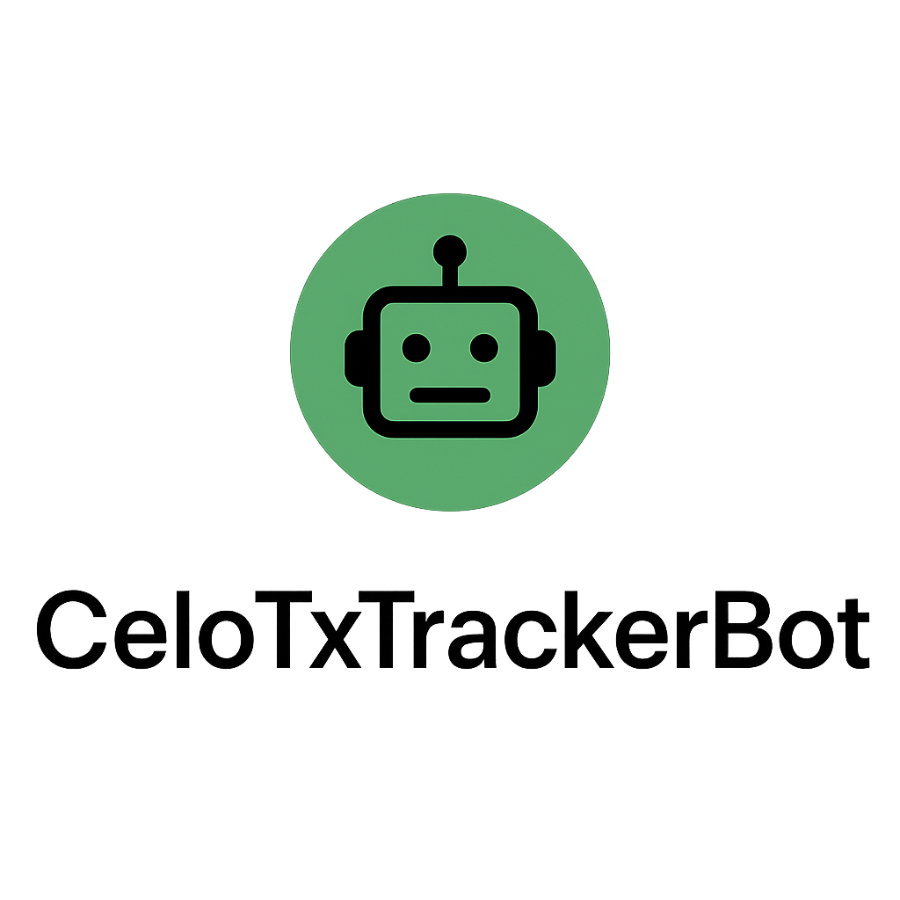

  

    
  

# CeloTxTrackerBot

A simple Proof of Ship project for the Celo ecosystem 🚀

## Overview

CeloTxTrackerBot is a lightweight tool that:

* Deploys a smart contract (`TxRegister.sol`) to Celo L1
* Allows users to register themselves on-chain
* Includes a Node.js bot that tracks outgoing transactions from a given address on Celo

## Project Milestones

1. Create Solidity smart contract `TxRegister`
2. Deploy contract on Celo mainnet
3. Build Node.js bot with ethers.js to track transactions
4. Integrate bot with Discord webhook (optional)

## How to Run in GitHub Codespaces

See the full step-by-step guide: [CODESPACES_GUIDE.md](CODESPACES_GUIDE.md)

1. **Create a `.env` file** (do not commit):
